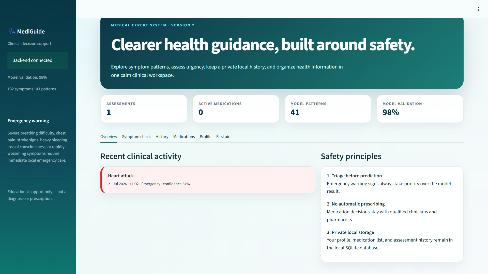
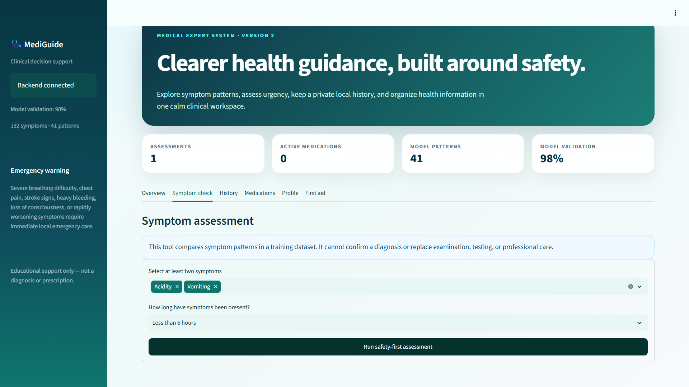
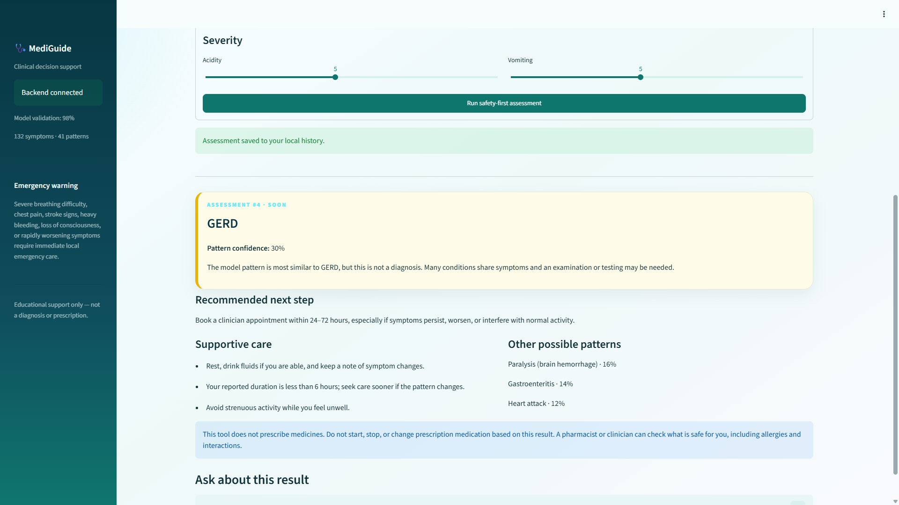
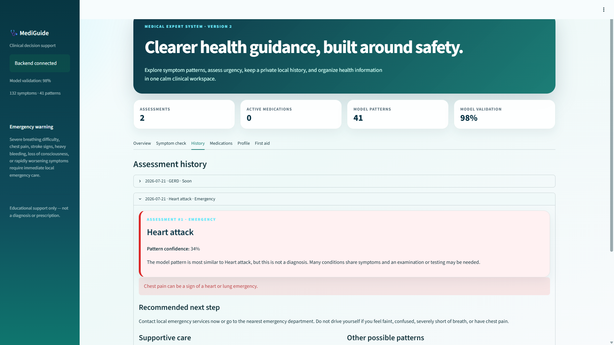
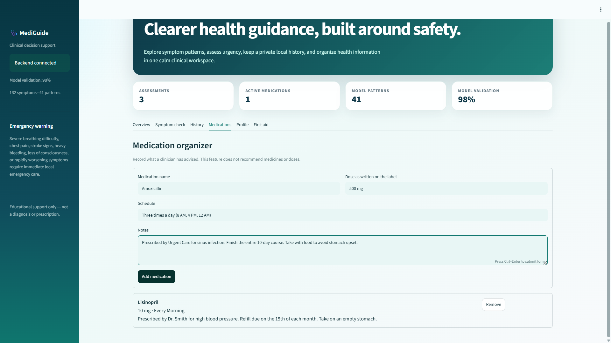
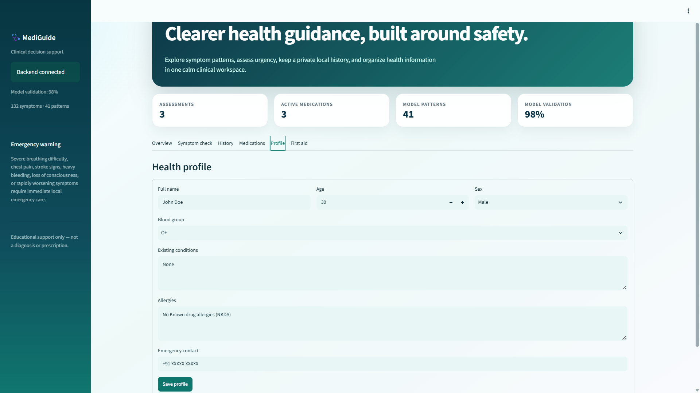
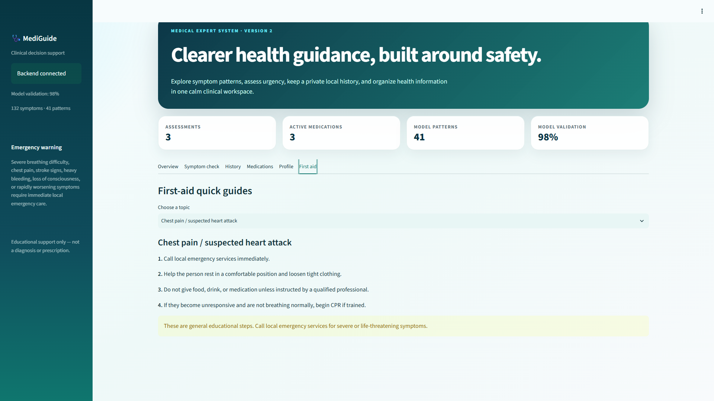
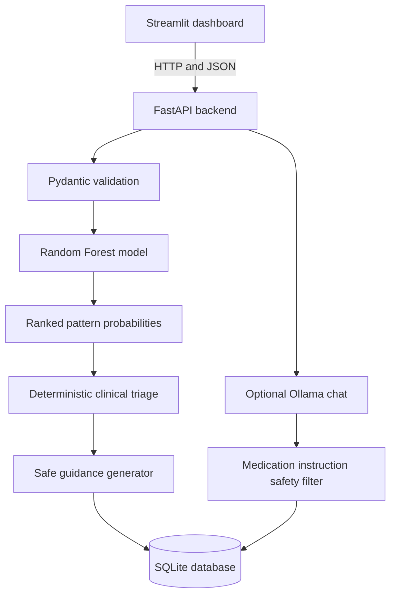

<div align="center">

# 🩺 MediGuide

### Safety-first symptom assessment and personal health organization.

A local-first medical decision-support project built with **Streamlit**, **FastAPI**, **SQLite**, and **scikit-learn**.

<br />

<a href="https://www.linkedin.com/in/anant-jodha/">
  
</a>
<a href="#features"></a>
<a href="#getting-started"></a>

<br /><br />










</div>

---

> [!CAUTION]
> **MediGuide is an educational software project, not a medical device.** It does not diagnose illness, prescribe medication, replace a clinician, or provide emergency care. Call your local emergency service immediately for severe breathing difficulty, chest pain, stroke signs, heavy bleeding, loss of consciousness, or rapidly worsening symptoms.

## About the project

**MediGuide Clinical Support** is a full-stack symptom-based expert system designed around a simple principle: **triage comes before prediction**.

Users can select symptoms, report their severity and duration, and receive a machine-learning pattern match with confidence estimates and alternative possibilities. A separate deterministic clinical rules layer checks for emergency warning signs and can override the model result with a higher urgency level.

The application also provides a private local assessment history, an assessment-specific educational chat, a medication organizer, a basic health profile, and first-aid quick guides. The frontend communicates with a documented REST API, while SQLite stores application records without requiring a separate database server.

## Project snapshot

| Metric | Current project |
|---|---:|
| Selectable symptoms | 132 |
| Learned condition patterns | 41 |
| Included test-set accuracy | 97.6% |
| Dashboard sections | 6 |
| SQLite tables | 4 |
| API operations | 14 |

> [!IMPORTANT]
> The reported accuracy is measured only against the bundled `dataset/Testing.csv`. It is **not** evidence of real-world diagnostic accuracy, clinical validity, safety, or suitability for patient care.

## Features

### Safety-first symptom assessment

- Search and select between 2 and 25 symptoms
- Record symptom severity on a 1–10 scale
- Choose a symptom-duration range
- Receive a probable condition pattern and confidence score
- Review three ranked alternative patterns
- See one of four urgency levels: `Emergency`, `Urgent`, `Soon`, or `Routine`
- Save every completed assessment to local history

### Independent emergency triage

- Checks symptoms against deterministic red-flag rules
- Escalates very high reported severity
- Gives emergency guidance before showing model interpretation
- Treats emergency rules independently from model confidence
- Includes clear next steps, supportive-care information, and medication-safety messaging

### Assessment history and follow-up chat

- Browse previous assessments in reverse chronological order
- Reopen symptoms, confidence, alternatives, urgency, and guidance
- Delete assessments and their related chat messages
- Ask educational questions about a saved result
- Use optional local Ollama generation or an offline safety-focused fallback
- Reject generated responses that appear to contain dosing or medication-change instructions

### Personal health workspace

- Maintain one local health profile
- Record age, sex, blood group, existing conditions, allergies, and an emergency contact
- Organize clinician-advised medications, label doses, schedules, and notes
- Remove outdated medication entries
- View recent activity and dashboard totals

### First-aid quick guides

Included educational guides cover:

- Chest pain or suspected heart attack
- Stroke warning signs
- Burns
- Choking
- Severe allergic reactions
- Cuts and bleeding

### Responsive clinical interface

- Teal and navy medical visual system
- Responsive wide-screen dashboard
- Urgency-colored result cards
- Sidebar backend and model status
- Cached symptom and first-aid data
- Six focused sections: Overview, Symptom check, History, Medications, Profile, and First aid

## How it works



1. The frontend requests the canonical symptom list from the API.
2. FastAPI validates symptom names, symptom count, severity values, and duration.
3. A Random Forest model calculates a ranked probability distribution.
4. Deterministic red-flag rules evaluate urgency independently.
5. The backend generates bounded educational guidance.
6. The completed assessment is saved to SQLite.
7. The frontend presents urgency before the probable condition pattern.

## Tech stack

| Layer | Technology |
|---|---|
| Frontend | Streamlit, custom HTML/CSS |
| Backend | Python, FastAPI, Uvicorn |
| Validation | Pydantic |
| Machine learning | scikit-learn Random Forest, pandas, NumPy |
| Database | SQLite with foreign keys and WAL mode |
| HTTP client | Requests |
| Optional local AI | Ollama |
| Testing | Pytest, FastAPI TestClient, HTTPX |

## Project structure

```text
Symptom Based Medical Expert System/
├── app.py                         # Streamlit medical dashboard
├── backend/
│   ├── __init__.py
│   ├── ai_service.py              # Ollama integration and safe fallback
│   ├── clinical.py                # Triage rules, guidance, and first aid
│   ├── config.py                  # Paths, environment variables, version
│   ├── database.py                # SQLite schema and data access
│   ├── main.py                    # FastAPI application and routes
│   ├── model_service.py           # Model training, evaluation, prediction
│   └── schemas.py                 # Pydantic request validation
├── dataset/
│   ├── Training.csv               # Bundled model-training data
│   └── Testing.csv                # Bundled validation data
├── scripts/
│   ├── import_legacy_history.py   # Safe JSON-to-SQLite migration
│   └── run_all.py                 # Starts backend and frontend together
├── tests/
│   └── test_api.py                # API, persistence, triage, and safety tests
├── .streamlit/
│   └── config.toml                # Streamlit medical theme
├── ARCHITECTURE.md                # Architecture notes
├── UPGRADE_SUMMARY.md             # Version 2 upgrade record
├── legacy_analysis_history.json   # Preserved records from the original app
├── pytest.ini                     # Test configuration
├── requirements.txt               # Python dependencies
└── data/
    └── medical_expert.db           # Generated locally; ignored by Git
```

## Getting started

### Requirements

- Python 3.10 or newer
- Git, when cloning the repository
- Ollama only when local generated chat responses are desired

Python 3.11, 3.12, or 3.13 is recommended for local development.

### Windows PowerShell

```powershell
git clone https://github.com/YOUR_USERNAME/mediguide-clinical-support.git
cd mediguide-clinical-support

py -3.13 -m venv .venv
.\.venv\Scripts\Activate.ps1

python -m pip install --upgrade pip
python -m pip install -r requirements.txt
python scripts/run_all.py
```

When PowerShell blocks virtual-environment activation, allow it for the current terminal session:

```powershell
Set-ExecutionPolicy -Scope Process -ExecutionPolicy Bypass
.\.venv\Scripts\Activate.ps1
```

### macOS and Linux

```bash
git clone https://github.com/YOUR_USERNAME/mediguide-clinical-support.git
cd mediguide-clinical-support

python3 -m venv .venv
source .venv/bin/activate

python -m pip install --upgrade pip
python -m pip install -r requirements.txt
python scripts/run_all.py
```

The startup script launches both services:

- Streamlit frontend: `http://127.0.0.1:8501`
- FastAPI documentation: `http://127.0.0.1:8000/docs`
- FastAPI health endpoint: `http://127.0.0.1:8000/api/health`

> Replace `YOUR_USERNAME` with your GitHub username before publishing this README.

## Run each service separately

Use two terminals when you want independent reload behavior.

### Terminal 1 — backend

```bash
uvicorn backend.main:app --reload --host 127.0.0.1 --port 8000
```

### Terminal 2 — frontend

```bash
streamlit run app.py --server.port 8501
```

## API overview

FastAPI generates interactive Swagger documentation automatically at `/docs`.

| Method | Route | Purpose |
|---|---|---|
| `GET` | `/` | API name, version, and documentation path |
| `GET` | `/api/health` | Backend, model, dataset, and validation status |
| `GET` | `/api/symptoms` | Canonical display-ready symptom list |
| `POST` | `/api/assessments` | Validate, predict, triage, guide, and save an assessment |
| `GET` | `/api/assessments` | List saved assessments |
| `GET` | `/api/assessments/{id}` | Retrieve one saved assessment |
| `DELETE` | `/api/assessments/{id}` | Delete an assessment and related chat |
| `GET` | `/api/profile` | Retrieve the local profile |
| `PUT` | `/api/profile` | Update the local profile |
| `GET` | `/api/medications` | List recorded medications |
| `POST` | `/api/medications` | Add a medication record |
| `DELETE` | `/api/medications/{id}` | Remove a medication record |
| `GET` | `/api/first-aid` | Retrieve first-aid guides |
| `GET` | `/api/assessments/{id}/chat` | List assessment chat messages |
| `POST` | `/api/assessments/{id}/chat` | Add a question and receive a safe response |

### Example assessment request

```bash
curl -X POST "http://127.0.0.1:8000/api/assessments" \
  -H "Content-Type: application/json" \
  -d '{
    "symptoms": ["Headache", "Nausea", "Vomiting"],
    "severity": {
      "Headache": 6,
      "Nausea": 5,
      "Vomiting": 5
    },
    "duration": "2–3 days"
  }'
```

## Machine-learning model

The model is trained from the bundled CSV files when the backend first needs it during a process:

- Algorithm: `RandomForestClassifier`
- Estimators: `280`
- Feature selection: `sqrt`
- Class weighting: `balanced_subsample`
- Random seed: `42`
- Input: binary symptom indicators
- Output: a probable pattern, confidence, and three alternatives
- Evaluation: accuracy against known labels in `dataset/Testing.csv`

The model service is cached in memory after training, so repeated API requests reuse the same model instance within that process.

## Clinical safety design

MediGuide deliberately separates prediction from urgency assessment.

### Emergency overrides

The current deterministic rules check for warning signs including chest pain, breathlessness, one-sided weakness, slurred speech, altered awareness, loss of consciousness, coughing blood, possible stomach bleeding, and a very fast heart rate. A reported severity of 9 or 10 also triggers emergency escalation.

### Medication boundaries

- The assessment response does not prescribe medication.
- The medication organizer only records information already provided by a clinician or medicine label.
- The chat prompt prohibits diagnosis, prescribing, and medication changes.
- Generated chat responses are filtered for dose units and medication-change instructions.
- Unsafe or unavailable generated responses fall back to fixed safety guidance.

## Database

SQLite is initialized automatically when the backend starts. By default, records are stored in:

```text
data/medical_expert.db
```

The database contains:

| Table | Stored data |
|---|---|
| `profiles` | One local profile and emergency contact |
| `medications` | User-entered medication records |
| `assessments` | Symptoms, severity, prediction, urgency, and guidance |
| `chat_messages` | Follow-up messages linked to assessments |

The database layer uses:

- Parameterized SQL queries
- Transactions with rollback on failure
- Foreign-key enforcement
- Cascading chat deletion when an assessment is removed
- SQLite WAL journal mode
- A process-level re-entrant lock for database access

### Reset local data

Stop both services, then delete the generated database:

```bash
rm -f data/medical_expert.db data/medical_expert.db-shm data/medical_expert.db-wal
```

On Windows PowerShell:

```powershell
Remove-Item data\medical_expert.db* -ErrorAction SilentlyContinue
```

The next backend start recreates the schema and the default empty profile.

## Environment variables

Environment variables are optional for local use.

| Variable | Default | Purpose |
|---|---|---|
| `MEDICAL_API_URL` | `http://127.0.0.1:8000` | Backend URL used by Streamlit |
| `MEDICAL_DATA_DIR` | `<project>/data` | Directory for generated local data |
| `MEDICAL_DATABASE_PATH` | `<project>/data/medical_expert.db` | Full custom SQLite path |
| `OLLAMA_API_URL` | `http://localhost:11434/api/generate` | Ollama generation endpoint |
| `OLLAMA_MODEL` | `mistral` | Ollama model name |

Example on macOS or Linux:

```bash
export MEDICAL_DATABASE_PATH="$HOME/.mediguide/medical_expert.db"
export OLLAMA_MODEL="mistral"
python scripts/run_all.py
```

Example on Windows PowerShell:

```powershell
$env:MEDICAL_DATABASE_PATH = "$HOME\.mediguide\medical_expert.db"
$env:OLLAMA_MODEL = "mistral"
python scripts/run_all.py
```

The project does not currently include automatic `.env` loading. Export variables in the shell or add a compatible environment loader before relying on a `.env` file.

## Optional local AI with Ollama

The follow-up chat works without Ollama by returning a deterministic safety-focused response. To enable local generation:

```bash
ollama serve
ollama pull mistral
```

Then start MediGuide normally. To use a different installed Ollama model:

```bash
export OLLAMA_MODEL="your-model-name"
python scripts/run_all.py
```

Ollama output remains subject to the application's medication-instruction safety filter.

## Import legacy assessment history

The original JSON history is preserved as `legacy_analysis_history.json`. Import compatible symptom records into SQLite with:

```bash
python scripts/import_legacy_history.py
```

The migration intentionally excludes old generated medication suggestions and chat replies because they may contain unsafe or outdated treatment advice.

Before importing, consider backing up the current database:

```bash
cp data/medical_expert.db data/medical_expert.backup.db
```

## Run the tests

With the virtual environment activated:

```bash
python -m pytest -q
```

The test suite covers:

- Health and symptom endpoints
- Assessment creation and persistence
- Emergency red-flag escalation
- Profile updates
- Medication creation and deletion
- Filtering of generated medication instructions

## Privacy and deployment notes

> [!WARNING]
> The default SQLite database is local but **not encrypted**. It may contain health-related information. Do not commit it, share it, or use real sensitive data on a shared computer.

- Generated database files are excluded through `.gitignore`.
- The application has no user accounts, access control, encryption at rest, audit log, or consent workflow.
- CORS is configured for local Streamlit origins only.
- The included startup configuration binds services to `127.0.0.1` by default.
- Do not expose this project directly to the public internet without authentication, HTTPS, secret management, data protection, logging controls, and a full security review.
- This repository is not validated for clinical, hospital, diagnostic, or production healthcare use.

## Troubleshooting

### The dashboard says `Backend unavailable`

Start the backend in the project root:

```bash
uvicorn backend.main:app --reload
```

Confirm that the health endpoint responds at `http://127.0.0.1:8000/api/health`.

### Port 8000 or 8501 is already in use

Find and stop the existing process, or run the services on different ports. When changing the backend port, update `MEDICAL_API_URL` before starting Streamlit.

```bash
uvicorn backend.main:app --port 8010
MEDICAL_API_URL=http://127.0.0.1:8010 streamlit run app.py
```

### Dependencies cannot be imported

Install them inside the active project environment:

```bash
python -m pip install -r requirements.txt
```

In VS Code, select the Python interpreter from the project's `.venv` directory.

### The model cannot find the dataset

Run commands from the repository root and confirm both files exist:

```text
dataset/Training.csv
dataset/Testing.csv
```

### Ollama chat uses the fallback response

This is expected when Ollama is unavailable, the configured model is missing, the request times out, or the generated answer fails the medication-safety filter.

Check Ollama separately:

```bash
ollama list
ollama serve
```

## Known limitations

- Symptom pattern matching cannot account for a full medical history, examination, vital signs, laboratory tests, imaging, pregnancy, age-specific risk, or medication interactions.
- Confidence scores reflect the trained classifier, not certainty that a condition is present.
- The bundled dataset may be simplified, imbalanced, incomplete, or unrepresentative of real clinical populations.
- Emergency rules are intentionally limited and cannot detect every urgent condition.
- The application supports one local profile and has no multi-user separation.
- Medication records do not provide reminders, interaction checks, or refill notifications.
- First-aid guides are brief educational summaries rather than certified training.
- Generated AI responses can still be incomplete or incorrect even after filtering.

## Future improvements

- Clinician-reviewed datasets and formal model documentation
- Calibration metrics, confusion matrices, and per-class evaluation
- Authentication and isolated multi-user records
- Encrypted storage and configurable record retention
- PostgreSQL support and database migrations
- Medication reminders without prescribing functionality
- Internationalized emergency guidance and first-aid content
- Accessibility testing and keyboard-navigation improvements
- Containerized development and deployment configuration
- Continuous integration for tests, type checking, and security scanning
- Exportable assessment summaries for clinician discussion

## Contributing

Contributions are welcome, especially improvements to safety boundaries, validation, accessibility, testing, documentation, and privacy.

```bash
git checkout -b feature/your-feature
python -m pytest -q
git add .
git commit -m "Add your feature"
git push origin feature/your-feature
```

Open a pull request with:

- A clear description of the change
- The reason it is needed
- Screenshots for interface changes
- Tests for backend or safety behavior
- Any medical-safety assumptions called out explicitly

Do not introduce diagnosis claims, treatment plans, medication recommendations, or emergency guidance without qualified clinical review.

Built to demonstrate how machine learning, deterministic triage, local data storage, and careful safety boundaries can work together in a modern health-support application.

### 👨‍💻 Anant Jodha

<a href="https://www.linkedin.com/in/anant-jodha/">
  
</a>

</div>
